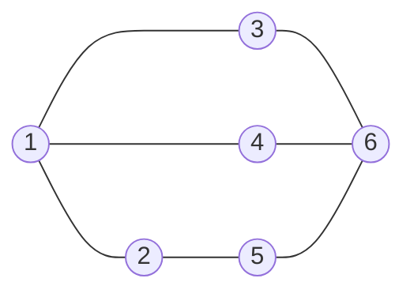
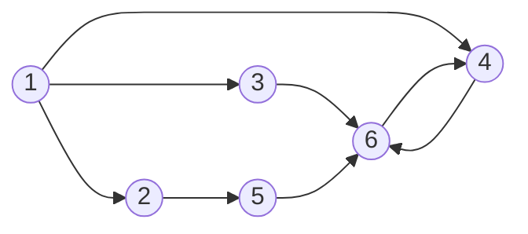
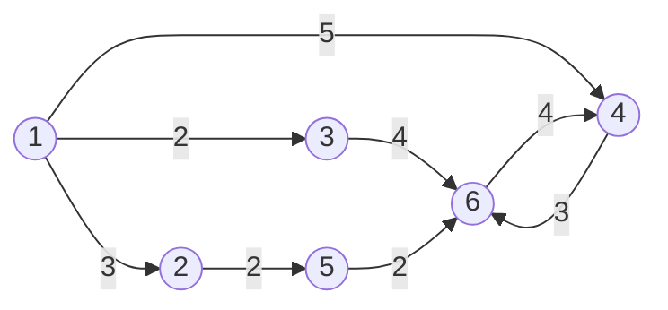
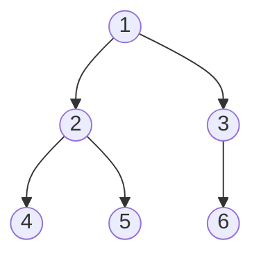

## 그래프란?

**그래프**(Graph)는 어떤 **관계**를 표현하는 수학 구조 입니다. **정점**(<mark>vertex</mark> 혹은 <mark>node</mark>)과 정점들을 연결하는 **간선**(<mark>edge</mark> 혹은 <mark>arc</mark>)으로 이루어진 비선형 자료구조입니다.

$G = (V, E)$
<br>보통 노드 u와 v를 연결하는 간선을 $e = (u,v)$라고 표현합니다.

## 그래프의 종류
### 무방향 그래프(undirected graph)

간선에 방향이 없어 양방향으로 이동할 수 있습니다.
<br>$(u,v) = (v,u)$



### 방향 그래프(directed graph)

간선에 방향이 있어 한쪽 방향으로만 이동할 수 있습니다.
<br>$(u,v) \neq (v,u)$



### 가중치 그래프

간선에 **비용**(cost) 또는 **거리**(distance)가 부여된 그래프입니다.



---

## 그래프 표현 방법
> **warning**: 이 글에서는 가중치가 없는 그래프만 고려합니다.
{: .prompt-warning }

### 인접 행렬 (Adjacency Matrix)
그래프를 부울 행렬(0과 1)로 표현하는 방법입니다. 그래프에 n개의 정점이 있다고 가정했을 때, n*n 크기의 2차원 행렬 adjMat[n][n]를 생성합니다. 정점 i에서 j로 가는 간선이 있는 경우 adjMat[i][j]를 1로 표시하고, 없는 경우 0으로 표시합니다.

$$
adjMat[i][j] = \begin{cases} 1 & \text{if edge (i, j) exists} \\ 0 & \text{otherwise} \end{cases}
$$

```python
import sys

# 간선 추가 (무방향)
def add_edge(u, v):
    graph[u][v] = 1
    graph[v][u] = 1

V = int(sys.stdin.readline().strip())   # 정점 수
E = int(sys.stdin.readline().strip())   # 간선 수

graph = [[0] * V for _ in range(V)] # unused variable이기 때문에 underscore 사용

for _ in range(E):
    u,v = map(int, sys.stdin.readline().strip().split())
    add_edge(u,v)

# 2차원 배열 형태로 출력
for row in graph:
    print(row)

"""
# 입력
4
3
0 1
1 2
2 3

# 출력
[0, 1, 0, 0]
[1, 0, 1, 0]
[0, 1, 0, 1]
[0, 0, 1, 0]
"""
```

- **장점**: 간선 존재 여부를 $O(1)$에 확인
- **단점**: 공간 복잡도 n*n크기의 2차원 배열이기 때문에 $O(V^2)$ — 정점이 많을수록 비효율적

### 인접 리스트 (Adjacency List)
그래프를 각 정점에 연결된 정점들의 목록으로 표현하는 방법입니다. 그래프에 n개의 정점이 있다고 가정했을 때, n개의 리스트를 가지는 배열 adjList[n]를 생성합니다. 정점 i에 연결된 정점들이 adjList[i]에 리스트 형태로 저장됩니다.

```python
import sys

# 간선 추가 (무방향)
def add_edge(u, v):
    graph[u].append(v)
    graph[v].append(u)

V = int(sys.stdin.readline().strip())   # 정점 수
E = int(sys.stdin.readline().strip())   # 간선 수

# 인접 리스트 초기화
graph = [[] for _ in range(V)]

# 간선 입력
for _ in range(E):
    u, v = map(int, sys.stdin.readline().strip().split())
    add_edge(u, v)

# 리스트 형태로 출력
for i in range(V):
    print(f"{i}: {graph[i]}")

"""
# 입력
4
3
0 1
1 2
2 3

# 출력
0: [1]
1: [0, 2]
2: [1, 3]
3: [2]
"""
```

- **장점**: 공간 복잡도 $O(V + E)$
- **단점**: 간선 존재 여부 확인에 $O(V)$ 소요 가능

> **tip**: 파이썬에서는 관계를 표현할 때 `dictionary`가 유용하며, 이를 활용한 인접 리스트 방식이 자연스럽습니다.  
또한 대부분의 코딩 테스트 문제는 정점에 비해 간선이 적은 희소 그래프 형태이기 때문에, 공간과 탐색 측면에서 인접 리스트가 더 효율적입니다.
{: .prompt-tip }

---

## 그래프 탐색

### <mark>DFS</mark> (깊이 우선 탐색)

한 방향으로 끝까지 깊게 탐색한 뒤, 더 이상 갈 수 없으면 이전으로 되돌아가 다른 경로를 탐색하는 방식입니다.  
이러한 특성 때문에 가능한 모든 경로를 빠짐없이 탐색할 수 있어, 경우의 수 탐색이나 경로 탐색 문제에 활용됩니다.  

또한 DFS는 탐색 과정에서 방문한 경로를 추적하기 때문에, 이미 방문한 노드를 다시 만나면 사이클이 존재함을 판단할 수 있어 사이클 탐지에 사용됩니다.  
이 외에도 DFS를 활용하여 위상 정렬과 같은 그래프 알고리즘을 구현할 수 있습니다.

▼ 아래의 자료를 참고하면 왜 visited를 관리해야하는지 이해할 수 있습니다.
<a href="https://wikidocs.net/196183" target="_blank"></a>

#### 재귀를 이용한 DFS 구현

```python
graph = {
    1: [2, 3, 5],
    2: [1, 3],
    3: [1, 2, 4],
    4: [3, 5],
    5: [1, 4]
}

def dfs_recursive(graph, node):
    visited = set()
    res = []

    def _dfs(u):
        if u in visited:
            return

        visited.add(u)
        res.append(u)

        for v in graph[u]:
            _dfs(v)

    _dfs(node)
    return res

print(dfs_recursive(graph, 1))

"""
# 결과
[1, 2, 3, 4, 5]
"""
```

#### 스택을 사용해 깊이 우선 탐색하기

> **warning**: 재귀 DFS는 Python 기본 재귀 한도(`sys.getrecursionlimit()` = 1000)에 걸릴 수 있습니다. 깊은 그래프에서는 `sys.setrecursionlimit()`을 늘리거나 **스택 기반 반복문**으로 구현하세요.
{: .prompt-warning }

### <mark>BFS</mark> (너비 우선 탐색)

**최단 경로(가중치 없는 그래프)**를 구할 때 유용합니다.



탐색 순서: `1 → 2 → 3 → 4 → 5 → 6`

```python
from collections import deque

def bfs(graph, start):
    visited = set([start])
    queue = deque([start])
    order = []

    while queue:
        node = queue.popleft()
        order.append(node)

        for neighbor in graph[node]:
            if neighbor not in visited:
                visited.add(neighbor)
                queue.append(neighbor)

    return order
```

> **info**: `deque`를 사용하는 이유는 `list.pop(0)`의 시간 복잡도가 $O(N)$인 반면, `deque.popleft()`는 $O(1)$이기 때문입니다.
{: .prompt-info }

### BFS vs DFS 비교

| 항목 | BFS | DFS |
|------|-----|-----|
| 자료구조 | 큐 (Queue) | 스택 / 재귀 |
| 시간 복잡도 | $O(V + E)$ | $O(V + E)$ |
| 공간 복잡도 | $O(V)$ | $O(V)$ |
| 최단 경로 | 보장 (비가중치) | 보장 안 됨 |
| 주요 활용 | 최단 거리, 레벨 탐색 | 사이클 탐지, 위상 정렬 |

---

## 그래프 알고리즘

### 위상 정렬
(To do)

---

## 관련 문제 체크리스트

- [x] [백준 1260 - DFS와 BFS](https://www.acmicpc.net/problem/1260)
- [x] [백준 2178 - 미로 탐색](https://www.acmicpc.net/problem/2178)
- [ ] [백준 1916 - 최소비용 구하기](https://www.acmicpc.net/problem/1916)
- [ ] [백준 1753 - 최단경로](https://www.acmicpc.net/problem/1753)
- [ ] [백준 11657 - 타임머신](https://www.acmicpc.net/problem/11657)

---

## 단축키 팁

코딩 테스트 중 PyCharm에서 빠르게 템플릿 불러오기:
<kbd>Ctrl</kbd> + <kbd>J</kbd>

---

## 정리

그래프 문제를 풀 때 다음 순서로 접근하면 도움이 됩니다.

1. **그래프 종류 파악** — 방향/무방향, 가중치 유무
2. **표현 방법 선택** — 인접 행렬 vs 인접 리스트
3. **탐색 방법 선택** — BFS (최단거리) vs DFS (경로 탐색)
4. **최단 경로 필요 여부** — 다익스트라 / 벨만-포드 / 플로이드-워셜

[^1]: 그래프 이론은 레온하르트 오일러가 1736년 쾨니히스베르크 다리 문제를 풀면서 시작되었습니다.[^1]


## 참고 자료
- [wikidocs - 좌충우돌, 파이썬으로 자료구조 구현하기](https://wikidocs.net/196182)