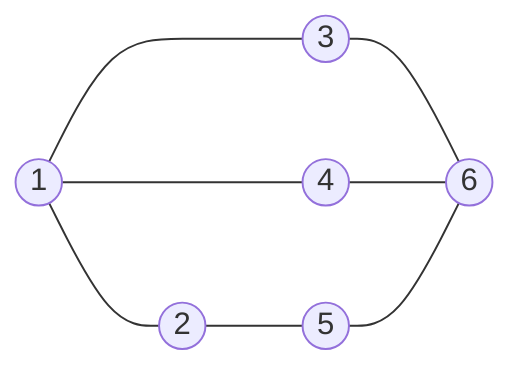
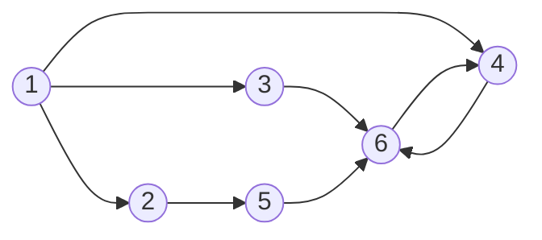
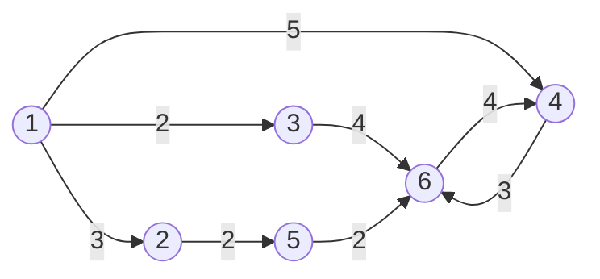
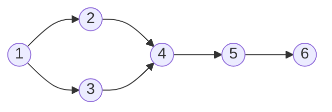

## 그래프란?

**그래프**(Graph)는 어떤 **관계**를 표현하는 수학 구조 입니다. **정점**(<mark>vertex</mark> 혹은 <mark>node</mark>)과 정점들을 연결하는 **간선**(<mark>edge</mark> 혹은 <mark>arc</mark>)으로 이루어진 비선형 자료구조입니다.

$G = (V, E)$
<br>보통 노드 u와 v를 연결하는 간선을 $e = (u,v)$라고 표현합니다.

## 그래프의 종류
### 무방향 그래프(undirected graph)

간선에 방향이 없어 양방향으로 이동할 수 있습니다.
<br>$(u,v) = (v,u)$



### 방향 그래프(directed graph)

간선에 방향이 있어 한쪽 방향으로만 이동할 수 있습니다.
<br>$(u,v) \neq (v,u)$



### 가중치 그래프

간선에 **비용**(cost) 또는 **거리**(distance)가 부여된 그래프입니다.



---

## 그래프 표현 방법
> **warning**: 이 글에서는 가중치가 없는 그래프만 고려합니다.
{: .prompt-warning }

### 인접 행렬 (Adjacency Matrix)
그래프를 부울 행렬(0과 1)로 표현하는 방법입니다. 그래프에 n개의 정점이 있다고 가정했을 때, n*n 크기의 2차원 행렬 adjMat[n][n]를 생성합니다. 정점 i에서 j로 가는 간선이 있는 경우 adjMat[i][j]를 1로 표시하고, 없는 경우 0으로 표시합니다.

$$
adjMat[i][j] = \begin{cases} 1 & \text{if edge (i, j) exists} \\ 0 & \text{otherwise} \end{cases}
$$

```python
import sys

# 간선 추가 (무방향)
def add_edge(u, v):
    graph[u][v] = 1
    graph[v][u] = 1

V = int(sys.stdin.readline().strip())   # 정점 수
E = int(sys.stdin.readline().strip())   # 간선 수

graph = [[0] * V for _ in range(V)] # unused variable이기 때문에 underscore 사용

for _ in range(E):
    u,v = map(int, sys.stdin.readline().strip().split())
    add_edge(u,v)

# 2차원 배열 형태로 출력
for row in graph:
    print(row)

"""
# 입력
4
3
0 1
1 2
2 3

# 출력
[0, 1, 0, 0]
[1, 0, 1, 0]
[0, 1, 0, 1]
[0, 0, 1, 0]
"""
```

- **장점**: 간선 존재 여부를 $O(1)$에 확인
- **단점**: 공간 복잡도 n*n크기의 2차원 배열이기 때문에 $O(V^2)$ — 정점이 많을수록 비효율적

### 인접 리스트 (Adjacency List)
그래프를 각 정점에 연결된 정점들의 목록으로 표현하는 방법입니다. 그래프에 n개의 정점이 있다고 가정했을 때, n개의 리스트를 가지는 배열 adjList[n]를 생성합니다. 정점 i에 연결된 정점들이 adjList[i]에 리스트 형태로 저장됩니다.

```python
import sys

# 간선 추가 (무방향)
def add_edge(u, v):
    graph[u].append(v)
    graph[v].append(u)

V = int(sys.stdin.readline().strip())   # 정점 수
E = int(sys.stdin.readline().strip())   # 간선 수

# 인접 리스트 초기화
graph = [[] for _ in range(V)]

# 간선 입력
for _ in range(E):
    u, v = map(int, sys.stdin.readline().strip().split())
    add_edge(u, v)

# 리스트 형태로 출력
for i in range(V):
    print(f"{i}: {graph[i]}")

"""
# 입력
4
3
0 1
1 2
2 3

# 출력
0: [1]
1: [0, 2]
2: [1, 3]
3: [2]
"""
```

- **장점**: 공간 복잡도 $O(V + E)$
- **단점**: 간선 존재 여부 확인에 $O(V)$ 소요 가능

> **tip**: 파이썬에서는 관계를 표현할 때 `dictionary`가 유용하며, 이를 활용한 인접 리스트 방식이 자연스럽습니다.  
또한 대부분의 코딩 테스트 문제는 정점에 비해 간선이 적은 희소 그래프 형태이기 때문에, 공간과 탐색 측면에서 인접 리스트가 더 효율적입니다.
{: .prompt-tip }

---

## 그래프 탐색

### <mark>DFS</mark> (깊이 우선 탐색)

한 방향으로 끝까지 깊게 탐색한 뒤, 더 이상 갈 수 없으면 이전으로 되돌아가 다른 경로를 탐색하는 방식입니다. 이러한 특성 때문에 시작 노드에서 도달 가능한 모든 경로를 빠짐없이 탐색할 수 있어, 경우의 수 탐색이나 경로 탐색 문제에 활용됩니다.
> **warning**: 단, 그래프 전체를 탐색하려면 모든 정점을 시작점으로 DFS를 반복 수행해야 합니다.
{: .prompt-warning }

또한 DFS는 탐색 과정에서 방문한 경로를 추적하기 때문에, 이미 방문한 노드를 다시 만나면 사이클이 존재함을 판단할 수 있어 사이클 탐지에 사용됩니다.  
이 외에도 DFS를 활용하여 위상 정렬과 같은 그래프 알고리즘을 구현할 수 있습니다.

▼ 아래의 자료를 참고하면 왜 visited를 관리해야하는지 이해할 수 있습니다.
<a href="https://wikidocs.net/196183" target="_blank"></a>

#### 재귀를 이용한 DFS 구현

```python
graph1 = {
    1: [2, 3, 5],
    2: [1, 3],
    3: [1, 2, 4],
    4: [3, 5],
    5: [1, 4]
}

def dfs_recursive(graph, node):
    # 방문한 노드를 저장해 중복 방문을 방지하려는 목적의 변수로 순서 추적이 필요 없음
    # 탐색 속도가 O(1)으로 더 빠른 set을 사용
    visited = set()
    res = []    # 결과에서는 탐색 순서를 기록해야하기 때문에 list 사용

    def _dfs(u):    # 내부에서만 쓰는 함수
        if u in visited:
            return

        visited.add(u)
        res.append(u)

        for v in graph[u]:
            _dfs(v)

    _dfs(node)
    return res

print(dfs_recursive(graph1, 1))

"""
# 결과
[1, 2, 3, 4, 5]
"""
```
> **warning**: 재귀 DFS는 Python의 기본 재귀 깊이 제한(`sys.getrecursionlimit()` ≈ 1000)에 걸려 `RecursionError`가 발생할 수 있습니다. `sys.setrecursionlimit()`으로 한도를 늘리거나 스택을 이용한 반복문 방식으로 구현하는 것이 안전합니다.
{: .prompt-warning }

<details>
<summary>재귀 DFS에서 발생하는 문제 예시</summary>
(To Do)
</details>


#### 스택을 사용해 깊이 우선 탐색하기

```python
graph1 = {
    1: [2, 3, 5],
    2: [1, 3],
    3: [1, 2, 4],
    4: [3, 5],
    5: [1, 4]
}

def dfs_stack(graph, node):
    res = []
    stack = [node]
    visited = set(stack)

    while stack:
        u = stack.pop()
        res.append(u)

        for v in graph[u]:
            if v not in visited:
                visited.add(v)
                stack.append(v)
    return res

print(dfs_stack(graph1, 1))

"""
# 결과
[1, 5, 4, 3, 2]
"""
```


### <mark>BFS</mark> (너비 우선 탐색)

가중치가 없는 그래프에서 시작점으로부터 각 노드까지의 최단 거리(간선 수 기준)를 구할 때 유용합니다.

```python
from collections import deque

graph1 = {
    1: [2, 3, 5],
    2: [1, 3],
    3: [1, 2, 4],
    4: [3, 5],
    5: [1, 4]
}

def bfs(graph, node):
    res = []
    queue = deque([node])
    visited = set(queue)

    while queue:
        u = queue.popleft()
        res.append(u)

        for v in graph[u]:
            if v not in visited:
                visited.add(v)
                queue.append(v)
    return res

print(dfs_stack(graph1, 1))

"""
# 결과
[1, 2, 3, 5, 4]
"""
```

> **info**: `deque`를 사용하는 이유는 `list.pop(0)`의 시간 복잡도가 $O(N)$인 반면, `deque.popleft()`는 $O(1)$이기 때문입니다.
{: .prompt-info }

### BFS vs DFS 언제 사용할까?

- 최단 거리 / 최소 이동 횟수 → BFS
- 모든 경우 탐색 / 경로 탐색 → DFS
- 레벨 단위 탐색 (층별) → BFS
- 깊이 우선 탐색 / 백트래킹 → DFS

---

## 그래프 알고리즘

### 위상 정렬 (Topological Sort)

**DAG(Directed Acyclic Graph, 방향 비순환 그래프)**에서 정점들을 간선의 방향을 거스르지 않도록 나열하는 알고리즘입니다.

> **info**: 위상 정렬은 사이클이 없는 방향 그래프(DAG)에서만 동작합니다. 사이클이 존재하면 순서를 결정할 수 없습니다.
{: .prompt-info }

아래 그래프에서 위상 정렬 결과는 `1 → 2 → 3 → 4 → 5 → 6` 또는 `1 → 3 → 2 → 4 → 5 → 6` 등 여러 가지가 될 수 있습니다.



#### 진입 차수(in-degree) 기반 구현 — 칸(Kahn) 알고리즘

**진입 차수(in-degree)**란 해당 정점으로 들어오는 간선의 수입니다. 진입 차수가 0인 정점은 선행 조건이 없으므로 가장 먼저 처리할 수 있습니다.

```python
from collections import deque

def topological_sort(graph, in_degree, V):
    queue = deque()
    result = []

    # 진입 차수가 0인 정점을 큐에 추가
    for v in range(1, V + 1):
        if in_degree[v] == 0:
            queue.append(v)

    while queue:
        u = queue.popleft()
        result.append(u)

        for v in graph[u]:
            in_degree[v] -= 1
            if in_degree[v] == 0:
                queue.append(v)

    # 모든 정점이 처리되지 않았다면 사이클 존재
    if len(result) != V:
        return []  # 사이클 존재

    return result
```

#### DFS 기반 구현

DFS 탐색이 끝나는 순서를 역순으로 쌓으면 위상 정렬 결과가 됩니다.

```python
def topological_sort_dfs(graph, V):
    visited = set()
    stack = []

    def dfs(u):
        visited.add(u)
        for v in graph[u]:
            if v not in visited:
                dfs(v)
        stack.append(u)  # 탐색이 끝난 후 스택에 추가

    for v in range(1, V + 1):
        if v not in visited:
            dfs(v)

    return stack[::-1]  # 역순 반환
```

#### 두 방법 비교

| | 칸(Kahn) 알고리즘 | DFS 기반 |
|---|---|---|
| 자료구조 | 큐 | 스택 / 재귀 |
| 사이클 탐지 | 자연스럽게 탐지 가능 | 별도 처리 필요 |
| 구현 난이도 | 직관적 | 상대적으로 까다로움 |

---

## 관련 문제 체크리스트

- [x] [백준 13023 - ABCDE](https://www.acmicpc.net/problem/13023)
- [x] [백준 1260 - DFS와 BFS](https://www.acmicpc.net/problem/1260)

---

## 참고 자료
- [wikidocs - 좌충우돌, 파이썬으로 자료구조 구현하기](https://wikidocs.net/196182)