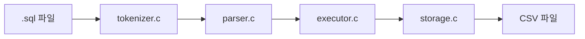

이번 주에는 `C`의 구조체와 포인터를 더 확실하게 익히기 위해 `Linked List` 문제풀이에 거의 한 주의 대부분을 쏟았다. 체감상 학습 시간의 80% 정도를 연결 리스트에 썼고, 나머지 시간에 `C99` 기반 파일형 SQL 처리기 미니 프로젝트를 진행했다. 이전 주차에는 알고리즘이나 프론트엔드 내부 구조를 주로 다뤘다면, 이번 주는 훨씬 더 기초적인 메모리 모델과 포인터 연결을 손으로 따라가며 익히는 시간에 가까웠다.

이번 주를 한 문장으로 정리하면, **"C 구조체와 포인터를 연결 리스트 문제로 끝까지 붙들고 늘어지면서, 남은 시간에는 SQL 처리 흐름을 구현자의 시선으로 따라가 본 주"** 였다.

## 이번 주 학습 정리

이번 주 학습의 중심은 분명히 `Linked List`였다. 단순히 문제를 많이 푼 것이 아니라, 구조체 정의를 읽고 `next` 포인터가 실제로 어떤 식으로 리스트를 이어주는지 계속 추적하는 방식으로 공부했다. `ListNode`, `LinkedList`처럼 익숙해 보이는 구조체도 직접 다루기 시작하면 `head`가 바뀌는 순간, `size`를 갱신하는 시점, 중간 노드를 끼워 넣거나 떼어낼 때 필요한 이전 노드 참조까지 전부 명확하게 이해해야 했다. 이번 주에는 이 감각을 몸에 익히는 데 가장 많은 시간을 썼다.

특히 `insertSortedLL`, `alternateMergeLinkedList`, `moveOddItemsToBack`, `frontBackSplitLinkedList`, `moveMaxToFront`, `RecursiveReverse` 같은 문제들을 풀면서, 연결 리스트는 결국 **데이터를 저장하는 문제라기보다 연결을 재배치하는 문제**라는 걸 더 강하게 느꼈다. 배열처럼 인덱스로 접근할 수 없기 때문에 현재 노드, 이전 노드, 다음 노드의 관계를 계속 머릿속에 유지해야 했고, 한 번 연결을 잘못 바꾸면 그 뒤 노드들을 통째로 잃을 수도 있었다. 그래서 코드 한 줄을 쓰기 전에 "지금 이 포인터가 정확히 누구를 가리키고 있는가"를 먼저 설명하는 습관이 조금씩 생겼다.

특히 문제를 풀수록 "예외 처리"가 더 중요하게 보였다. 빈 리스트, 원소가 하나뿐인 리스트, 첫 번째 노드가 정답인 경우, 마지막 노드가 이동 대상인 경우처럼 얼핏 사소해 보이는 케이스들이 실제로는 전체 코드의 안정성을 결정했다. 연결 리스트 문제는 코드 길이만 보면 짧아 보이지만, 막상 구현해보면 포인터 하나를 놓치는 순간 리스트 전체가 깨질 수 있어서, 작은 문제일수록 더 천천히 연결 상태를 추적해야 한다는 걸 배웠다.

재귀로 뒤집는 문제도 인상적이었다. `RecursiveReverse`를 구현할 때는 처음엔 "재귀 호출이 끝나면 알아서 뒤집혀 있겠지"라고 막연히 생각하기 쉬웠는데, 실제로는 `head->next->next = head`, `head->next = NULL`처럼 복귀 시점에 링크를 다시 정리해주는 한 줄 한 줄의 의미를 정확히 이해해야 했다. 이 문제를 풀면서 재귀는 단순히 함수를 다시 호출하는 기법이 아니라, **현재 노드와 나머지 리스트의 관계를 어떻게 끊고 다시 붙일지를 설계하는 방식**이라는 점을 더 선명하게 느꼈다.

무엇보다 링크드리스트를 풀면서 가장 크게 느낀 점은, 포인터 문제는 머릿속으로만 생각하면 자꾸 틀린다는 것이었다. `prev`, `curr`, `next`, `tail`을 종이에 그려보거나 직접 변수 이름으로 분리해두면 흐름이 훨씬 또렷해졌고, 반대로 성급하게 한 번에 구현하려고 하면 어디서 연결이 끊겼는지 금방 놓치게 됐다. 이번에는 문제 수 자체보다도, **포인터를 다루는 코드는 반드시 상태 변화를 눈에 보이게 추적해야 한다**는 습관을 얻은 것이 더 의미 있었다.

남은 시간에는 프로젝트도 진행했다. 다만 이 프로젝트는 이번 주의 주인공이라기보다, 링크드리스트와 포인터 학습 다음으로 이어진 두 번째 흐름에 가까웠다. 구조체와 포인터를 계속 붙들고 있던 상태에서 SQL 처리기를 구현해보니, 문자열을 토큰으로 자르고 구조체로 바꾸는 과정도 이전보다 더 잘 보였다. 연결 리스트에서 포인터와 구조를 다뤘던 감각이 프로젝트 안에서도 자연스럽게 이어졌다.

## 그다음으로 진행한 프로젝트 구현 경험

이번 주 프로젝트의 목표는 범위를 크게 잡는 것이 아니었다. 오히려 `WHERE`, `JOIN`, `UPDATE`, `DELETE` 같은 기능은 과감히 제외하고, **단일 테이블 기준의 `INSERT`, `SELECT`, CSV 헤더 자동 생성**만 정확하게 동작하게 만드는 데 집중했다. SQL이라는 이름 때문에 처음에는 욕심이 커지기 쉬웠지만, 실제로 구현을 시작해보니 핵심 흐름을 이해하려면 오히려 기능을 줄이는 편이 더 맞았다.

프로젝트의 전체 흐름은 아래처럼 정리할 수 있었다.

가장 먼저 배운 점은 `tokenizer`, `parser`, `executor`를 분리하는 이유였다. SQL 문자열을 한 번에 해석하려고 하면 조건 분기와 예외 처리가 한곳에 엉키기 쉬웠다. 그런데 문자열을 먼저 토큰 배열로 자르고, 그 토큰을 다시 구조체로 바꾸고, 마지막에 실행기로 넘기는 식으로 단계를 나누니 각 파일의 책임이 훨씬 분명해졌다.

특히 `tokenizer`를 구현하면서는 "문자열을 읽는다"는 행위가 생각보다 단순하지 않다는 걸 느꼈다. 공백, 숫자, 문자열 리터럴, 괄호, 쉼표, 세미콜론을 각각 다른 규칙으로 읽어야 했고, 이 과정에서 `line`, `column` 정보를 함께 저장해두지 않으면 오류 메시지를 제대로 만들 수 없었다. 예를 들어 지원하지 않는 문자를 만나거나 문자열 리터럴이 닫히지 않았을 때, 단순히 실패했다는 사실만 주는 것보다 **어디서 실패했는지 알려주는 정보가 훨씬 중요하다**는 걸 직접 체감했다.

파서 단계에서는 토큰을 `InsertStatement`, `SelectStatement` 같은 구조체로 바꾸는 경험이 인상적이었다. 평소에는 SQL을 문자열 그대로 보게 되는데, 구현 과정에서는 결국 이 문장이 "테이블 이름", "컬럼 목록", "값 목록" 같은 구조로 정리되어야 다음 단계에서 처리할 수 있었다. 이 과정에서 문법은 결국 사람이 읽는 문장이 아니라, **기계가 처리할 수 있는 데이터 구조로 바뀌어야 한다**는 점이 확실히 보였다.

이번 주 구현에서 가장 의미 있었던 부분은 `schema`를 기준으로 실행 흐름을 정리한 것이었다. 테이블의 기준 정보는 `schemas/<table>.schema` 파일에 두고, 실제 데이터는 `data/<table>.csv`에 저장하는 구조를 택했다. 이때 스키마 파일의 컬럼 순서가 CSV 헤더 순서가 되기 때문에, 사용자가 `INSERT INTO users (name, age, id) ...`처럼 컬럼 순서를 바꿔 적더라도 내부에서는 다시 스키마 순서로 정렬해 저장할 수 있었다.

이 작업을 하면서 느낀 점은, SQL 문법을 파싱하는 것만으로는 절반밖에 끝나지 않는다는 것이었다. 진짜 중요한 건 실행 단계에서 **입력된 값이 스키마와 맞는지**, **컬럼 이름이 실제로 존재하는지**, **결과를 어떤 순서로 저장할지**를 결정하는 일이었다. 즉, 파싱이 문장을 이해하는 단계라면 실행은 그 문장을 실제 데이터 규칙에 맞게 검증하는 단계였다.

또 하나 크게 배운 부분은 `executor`와 `storage`를 분리한 경험이었다. 처음에는 CSV 파일 입출력까지 실행기 안에서 다 처리해도 될 것처럼 보였지만, 그렇게 하면 "SQL 의미를 검증하는 코드"와 "파일을 열고 헤더를 만들고 행을 쓰는 코드"가 한 파일에 섞이게 된다. 그래서 이번에는 실행기에서는 스키마 확인과 컬럼/타입 검증만 맡고, 실제 CSV 생성과 조회 출력은 `storage.c`로 분리했다. 이 분리를 통해 `executor`는 "무엇을 저장할지"를 결정하고, `storage`는 "어떻게 저장할지"를 담당하는 구조가 됐다.

이 부분은 단순한 리팩터링 이상의 의미가 있었다. 작은 프로젝트에서도 책임 경계를 먼저 세워두지 않으면, 기능이 조금만 늘어나도 코드가 빠르게 읽기 어려워진다는 걸 확인했기 때문이다. 특히 이번 프로젝트는 교육용 SQL 처리기라는 성격이 강했기 때문에, 실행 흐름이 눈에 보여야 했고 초심자도 따라갈 수 있어야 했다. 그런 면에서 storage 계층을 최소 인터페이스 두 개로 압축한 결정은 꽤 좋은 선택이었다고 느꼈다.

## 구현하면서 특히 배운 점

이번 주에는 기능 구현 자체보다도, **무엇을 어디서 검증해야 하는가**를 계속 생각하게 됐다.

예를 들어 오류는 한 종류가 아니었다.

- tokenizer 단계에서는 지원하지 않는 문자나 닫히지 않은 문자열 리터럴을 잡아야 했다.
- parser 단계에서는 `FROM` 누락, 세미콜론 누락, 컬럼 수와 값 수 불일치를 잡아야 했다.
- executor 단계에서는 스키마에 없는 컬럼, 타입 불일치를 잡아야 했다.
- storage 단계에서는 CSV 헤더 형식 불일치나 파일 생성 실패를 따로 처리해야 했다.

이렇게 보니 "오류 처리"도 하나의 기능이 아니라, 각 계층의 책임과 정확히 연결된 설계 문제라는 점이 분명해졌다. 어느 단계에서 어떤 오류를 잡아야 하는지를 먼저 정리하니 코드도 자연스럽게 정리됐다.

테스트를 작성하면서도 비슷한 점을 느꼈다. 단순히 정상 입력만 통과시키는 테스트보다, 헤더 자동 생성, 잘못된 헤더, 컬럼 순서 변경, 출력 캡처 같은 케이스를 넣어보니 구현의 빈틈이 더 잘 보였다. 특히 이번 프로젝트는 결과가 콘솔 출력과 CSV 파일 둘 다로 나타나기 때문에, 테스트 역시 "파싱 성공"만 보는 것이 아니라 실제 파일 상태와 출력 결과까지 확인해야 했다. 덕분에 **작은 기능일수록 통합 흐름을 끝까지 검증하는 테스트가 중요하다**는 점을 다시 느꼈다.

## 이번 주를 돌아보며

이번 주 공부는 단순히 연결 리스트 문제 몇 개를 풀고, SQL 기능 두세 개를 구현한 경험으로 끝나지 않았다. 오히려 더 크게 남은 것은, 익숙한 기술도 직접 구현해보면 전혀 다른 층위의 이해가 열린다는 점이었다. 링크드리스트에서는 "노드를 앞에 옮긴다", "뒤집는다", "반으로 나눈다" 같은 문장을 평소에는 간단하게 받아들이지만, 실제 구현에서는 매 순간 포인터가 어디를 가리키는지를 설명할 수 있어야만 코드가 성립했다. SQL 처리기 역시 평소에는 `SELECT * FROM users;` 같은 문장을 자연스럽게 쓰지만, 직접 만들기 시작하면 그 한 줄 안에 토큰화, 문법 해석, 구조체 변환, 스키마 검증, 파일 입출력이라는 여러 단계가 숨어 있다는 걸 보게 된다.

또 하나 인상적이었던 점은 "기초를 끝까지 추적하는 연습"과 "기능을 줄이는 설계"의 중요성이었다. 이번 주 시간의 대부분을 링크드리스트에 쓰면서 구조체와 포인터를 제대로 이해하지 못하면 그 위의 어떤 응용도 불안정하다는 걸 느꼈고, 프로젝트에서는 구현 범위를 최소로 고정했기 때문에 오히려 각 단계의 역할과 데이터 흐름을 더 또렷하게 이해할 수 있었다. 이번 주는 많은 기능을 넣은 주가 아니라, **가장 기초적인 연결과 구조를 끝까지 추적하면서 그 위에 작은 프로젝트를 얹어본 주**에 가까웠다.

다음에는 여기서 한 걸음 더 나아가, 링크드리스트를 단순 구현에서 끝내지 않고 시간 복잡도와 메모리 안정성까지 함께 설명하는 연습을 해보고 싶고, 프로젝트도 이번에 만든 최소 SQL 처리기를 바탕으로 조건 처리나 더 복잡한 문법으로 확장해보고 싶다. 다만 이번 주에 배운 가장 큰 교훈은 기능 추가 자체보다, 먼저 현재 포인터가 왜 이렇게 연결되어야 하는지와 현재 구조가 왜 이렇게 나뉘어야 하는지를 설명할 수 있어야 한다는 점이었다. 그런 의미에서 이번 주는 "프로젝트를 했다"기보다, **C의 구조체와 포인터를 연결 리스트로 깊게 익히고, 그 감각을 프로젝트 구현으로 이어본 주**였다.
